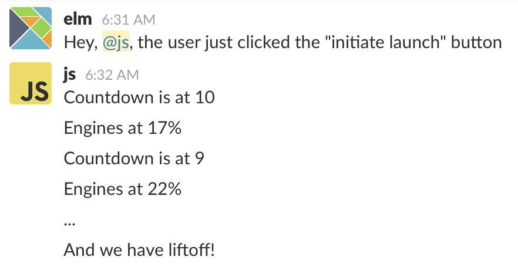
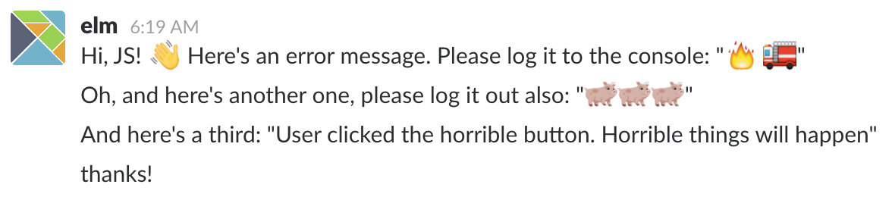
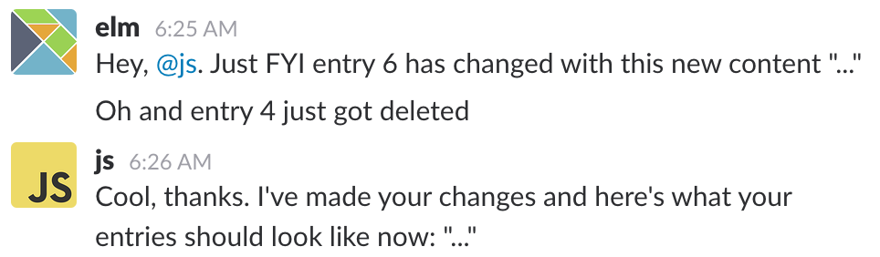
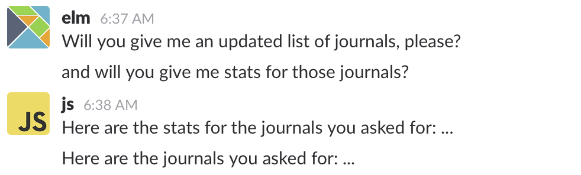

---?image=img/title.jpg&size=cover
<style>
.reveal .slides {
    text-align: left;
}
.reveal .slides h1 {
  font-size: 3.75rem;
}
.reveal .slides section>* {
    margin-left: 0;
    margin-right: 0;
}
</style>

# The Importance of Ports

## Murphy Randle
- Work: [Day One](https://dayoneapp.com)
- Twitter: [@splodingsocks](https://twitter.com/splodingsocks)
- Elm Town Podcast!

Note:
- I'm Murphy Randle
- I'm the host of Elm Town
- and I work at Day One where we make a journaling app.
- Today I'm going to show you why ports are so important to us at Day One.
- But first:

---?image=img/story-time.jpg&size=cover

# Story Time
## or, how this talk was born

<span style="font-size: .75rem; color: rgba(255,255,255,0.5); position: absolute; bottom: 1rem; left: 1rem">
Photo by Dariusz Sankowski on Unsplash
</span>

+++

## The Situation
- Client-side database |
- Hand-written native code to wrap DB |

## The Sadness
- Runtime errors 😭 |
- No compiler help |

+++

## The Conversation
- Mentioned in Slack bad experience with native code |
- Mentioned that using ports would be even worse |

## The Change of Perspective
- Evan replied |
- I had been using an incorrect mental model of ports |
- I revised my brain and re-architected |

+++

# The Result
- No more native code |
- 💸💰🤑💸💰🤑💸💰🤑 |
- Elm & JS remain separate worlds with separate concerns |
- Scaling JS-Elm interaction is simple (a simple pattern is simple to follow) |

---

# Let's Build Something

[pocketjournal.splode.co](https://pocketjournal.splode.co)
- Users can create, edit, and delete entries |
- Data stored locally in IndexedDB |

---

> [Ports are] like JavaScript-as-a-Service

from guide.elm-lang.org

---

# First Attempt

+++

# Outgoing port
```elm
port doSomethingInJsWithAString : String -> Cmd msg
-- That's it, no body definition
```

# Incoming Port
```elm
port stringsComingFromJs : (List String -> msg) -> Sub msg
-- That's it, no body definition
```

+++?code=example/src/BadPortExample.elm&lang=elm

@[4-11](Make a port for each request and its accompanying response)
@[14-18](Plus a new message for each one of the "responses" above)
@[21-29](Plus a case for each of those "response" messages in the update function)
@[32-36](Plus a new subscription fo reach of those "reponse" messages)
@[39-50](Plus JS code to subscribe to and trigger each of these ports)

+++

# What makes this hard and unpleasant?

+++

- Adding a JS operation requires two new ports
- Adding a JS operation potentially requires changes across 3+ files |
- Request + response ports don't feel natural |
  - What if a response comes when there's no request? |
  - What if a response comes back multiple times? |
  - When a response comes through, how do I connect it with a particular request? |

---

# JavaScript as a service

- Ports make JavaScript == Service
  - BUT 🛄
    - Service `/=` server
    - Ports `/=` HTTP + Promises

---

# The Actor Model

+++

# The Actor Model


+++

# The Actor Model

The interaction between Elm & JS is modeled on this mature design pattern made for concurrent systems.

+++

This is why the request / response port pairs felt awkward.

+++

~~request / response~~
<br>
Information in / Information out

+++

Sort of like chatting in Slack!

+++

For one message out, we can get many in:


+++

Or none in:


+++

Or many out, and just one in:


+++

Messages in may be out of order:


+++

Or they may (practically) never come:


+++

And we might never send any out, but still get some in:


+++

This is a good thing. 👍
And we're not the first to the party.

+++

# Languages / Frameworks / APIs that use the Actor model

- Erlang / Elixir |
- Web Workers (in the HTML Standard) |
- Scala (Akka) |
- Python (using Pulsar) |
- and more! |
- Listen to Elm Town 13 for more background |

---

# Second Attempt

+++

First, put the data in the right place
- In this case, JS owns the data |
- Notify the DB of changes to enties |
- When changes happen, the DB sends all entries back to Elm |

+++

Second, use just one port
- Don't "wrap" some particular JS library API |
- Everything in JS is an implementation detail |
- Design an API to talk with JS that makes sense |

+++

# Let's design a pattern for an API
- And let's call it the "Outside Info" pattern|

+++?code=example/src/OutsideInfo.elm

@[57-60](Just two ports now, for the whole app)
@[53-54](One generic data structure for sending information between worlds)
@[42-46](Any and all messages to the outside appear in this type)
@[49-50](Any and all messages that can come from the outside appear in this type)
@[8](A single function for communicating with JS that produces a command)
@[11-12](Handles all different message types and converts them to OutsideInfo)
@[24](A single subscription for getting info from JS)
@[29-32](Decodes data into a message based on the tag in OutsideInfo)
@[34-35](If a message comes along we don't understand, we can log it, or show an error in the UI)

+++?code=example/src/index.js

@[6](Subscribe to the single Elm -> JS port)
@[9](Make a new if / else branch for each type in InfoForOutside )
@[50](Send in a message to Elm for any type in InfoForElm)

+++

# The "Outside Info" Pattern In Summary

- One port |
- One data structure for moving information across language borders |
  - Serialize data on exit |
  - Deserialize data on entrance |
- Send info, receive info, no requests/responses |

---
# Why the Actor Model? A Case Study
---?image=graphics/Before@2x.png&size=contain
---?image=graphics/After@2x.png&size=contain

Note:
The API for Web Workers follows a pattern like the Actor Model. No re-architecting and almost zero work was required to connect the JS back up with Elm after moving all of the JS code into a Web worker. Instead of two actors passing messages, we now had three. That's all.
---

# DEMO TIME

Note:
Demo the Day One Web app in full glory syncing multiple journals with hundreds of entries while still seamlessly navigating around the UI. Show off the async image loading as well.

---

# That's It!
